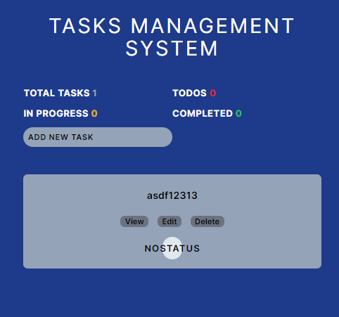

### 📸 learn-nextjs14-mobx


#### This is a task management system application that allows users to create, track, and manage their tasks.
#### Showcasing the use of local storage in Next.js with MobX, utilizing react hook.

-------------------------------------------------

### ⚙️ Technology Stack


-------------------------------------------------
### 📝 Local State management
Mobx data is stored in local storage.

[//]: # (![Reducer]&#40;https://img.shields.io/badge/Reducer-%2320232a.svg?style=for-the-badge&logo=react&logoColor=%2361DAFB&#41;)


-------------------------------------------------
### ‍💻 Getting Started
```bash
npm run dev
# or
yarn dev
```
-------------------------------------------------

## 📖 TODO
- Create and manage tasks
- Add new tasks
- Edit existing tasks
- Delete Tasks
- Every individual contains Title, Description, Status

### 🌐 Learn More

>This is a [Next.js](https://nextjs.org/)


# Task Management System


## Features


## Getting Started

To get started, you will need to install the application. You can do this by cloning the repository from GitHub and running the following command:

git clone https://github.com/sain-fullstack-developer/Managing-Tasks-App.git

npm install

Once the application is installed, you can start it by running the following command:

npm run dev

The application will be started on port 3000. You can access it by opening a web browser and navigating to `http://localhost:3000`.

## Documentation

The documentation for the task management system application is available on the GitHub repository. You can find the documentation by clicking on the "Documentation" tab.

## Contributing

Contributions to the task management system application are welcome. You can contribute by submitting bug reports, feature requests, or code changes.

## License

The task management system application is licensed under the MIT License. You can find the license information in the LICENSE file.

